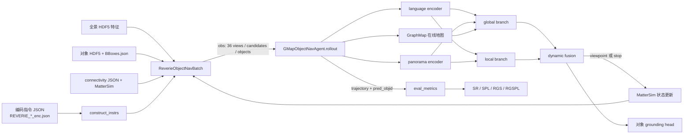

# VLN-DUET 新手代码库说明

> 冻结基线：官方仓库 `https://github.com/cshizhe/VLN-DUET.git`，`main` 分支，commit `93e8b233164bc079a6db48b8a0a78d123ec8de41`（2026-08-12 接管时）。本文只说明现有代码；没有修改模型、训练、推理或评测逻辑。

## 0. 如何阅读本文

本文使用四种证据标记：

- `[源码确认]`：由当前 commit 的实际代码或脚本直接确认。
- `[官方说明]`：由仓库 README、论文或官方项目页确认。
- `[尚未实测]`：仓库中存在相应流程，但本机缺少依赖、数据或权重，未成功执行。
- `[工程推断]`：由调用关系作出的工程判断，必须在后续复现中再验证。

相对路径都从仓库根目录算起。命令块会另外写明工作目录。不要把“脚本里写了”理解成“本机已经跑通”。

### 0.1 接管元数据

| 项目 | 2026-08-12 接管结果 |
|---|---|
| clone 位置 | `/root/autodl-tmp/ProofNav` |
| `origin` | `https://github.com/cshizhe/VLN-DUET.git`（fetch/push） |
| remote 默认分支 | `main` |
| 当前分支 / SHA | `main` / `93e8b233164bc079a6db48b8a0a78d123ec8de41` |
| clone 深度 | shallow clone；当前 HEAD 与远程 HEAD 一致 |
| submodule | 无 `.gitmodules`，`git submodule status --recursive` 无输出 |
| Git LFS | git-lfs 可执行文件存在，但仓库无 `.gitattributes`、`git lfs ls-files` 无输出 |
| 许可证 | 仓库树无 `LICENSE`/`COPYING`，GitHub 页面未声明许可证 |
| 初始工作区 | 克隆后 `git status` 干净；本轮只新增文档 |

## 1. DUET 在解决什么任务

[官方说明] 视觉—语言导航（Vision-and-Language Navigation，VLN）要求智能体根据自然语言，在此前未见的室内环境中移动。DUET（Dual-scale Graph Transformer，双尺度图 Transformer）一边在线构建拓扑地图，一边联合使用全局地图和当前局部全景来选动作。论文与仓库分别见 [DUET 论文](https://arxiv.org/abs/2202.11742) 和 [官方仓库](https://github.com/cshizhe/VLN-DUET)。

四个仓库支持的任务不是同一个问题：

| 数据集 | 指令/目标 | 成功条件 | 本仓库入口 | 关键差别 |
|---|---|---|---|---|
| REVERIE | 从远处描述一个物体及其环境 | 导航到能看到目标物体的 viewpoint，并预测正确 `objId` | `map_nav_src/reverie/main_nav_obj.py` | 同时做导航与对象 grounding（目标落地） |
| SOON | 较长、分解为 attribute/relation/region 等字段的目标描述 | 到达目标附近，并用 heading/elevation 指向目标框 | `map_nav_src/soon/main.py` | 目标输出是方向点，不是 REVERIE 的对象 ID |
| R2R | 细粒度路线指令 | 最终位置距参考终点小于 3 m | `map_nav_src/r2r/main_nav.py` | 只有路线导航，没有对象 grounding |
| R4R | 由 R2R 路线组合出的更长路径 | 与 R2R 类似，另看路径忠实度 | 同样使用 `map_nav_src/r2r/main_nav.py --dataset r4r` | 预训练有独立配置；微调脚本存在明显静态风险，见第 15 节 |

[官方说明] REVERIE 的原始任务要求根据远程自然语言指代表达，导航后识别对象；参见 [REVERIE 论文](https://arxiv.org/abs/1904.10151)。[源码确认] 当前仓库所有这四种任务都默认目标/路线有效，只有普通 `[stop]`；它没有 `FOUND`/`NOT-FOUND` 双向判定、证书或风险账本。

## 2. 一条 REVERIE episode 怎样走完

以下是最重要的主链，第一次读代码先沿它走一遍。



### 2.1 输入与环境重置

1. `[源码确认]` `map_nav_src/reverie/main_nav_obj.py::build_dataset` 创建 tokenizer、`ImageFeaturesDB`、`ObjectFeatureDB`，读取 `BBoxes.json`，再构造 train/validation 环境。
2. `[源码确认]` `map_nav_src/reverie/data_utils.py::construct_instrs` 把一条包含多句 instruction 的 annotation 拆成多个 episode；`instr_id` 格式为 `path_id_objId_句序号`。
3. `[源码确认]` `map_nav_src/reverie/env.py::ReverieObjectNavBatch.reset` 取 minibatch，并让 `MatterSim.Simulator` 从 `path[0]` 和给定 heading 开始。
4. `[源码确认]` `_get_obs` 合并当前 simulator state、36 个离散视角的预计算特征、相邻可走 viewpoint、对象特征、指令编码和训练真值。

一个 observation 的关键字段如下：

| 字段 | 含义 |
|---|---|
| `scan`, `viewpoint`, `position` | 当前建筑、离散视点 ID、三维位置 |
| `viewIndex`, `heading`, `elevation` | 当前朝向；36 视角为 3 个 elevation × 12 个 heading |
| `feature` | 36 个图像特征拼接角度特征 |
| `candidate` | 从当前视点可到达的相邻 viewpoint；含 `pointId`、角度、位置和特征。首次构造时的 `distance` 是挑选代表 view 用的角距离，不是路程，而且缓存后的 candidate 不再含该字段 |
| `obj_img_fts`, `obj_ang_fts`, `obj_box_fts`, `obj_ids` | 当前视点的候选对象特征、方向编码、由 size 派生的归一化高/宽/面积和对象 ID；不含 raw bbox 或 detector confidence |
| `instr_encoding` | 已编码并截断的指令 token ID |
| `gt_path`, `gt_end_vps`, `gt_obj_id`, `distance` | 仅训练/有标签评测使用的真值；ProofNav 在线状态必须通过白名单剔除 |

### 2.2 语言、全景与地图编码

1. `[源码确认]` `map_nav_src/reverie/agent_obj.py::GMapObjectNavAgent._language_variable` padding 指令；`VLNBert('language', ...)` 只在 episode 开始编码一次。
2. `[源码确认]` `_panorama_feature_variable` 把可导航 view 放在前面，补入其余 36-view token，再接对象 token；`nav_types` 用 `0/1/2` 表示不可走视角/可走视角/对象。
3. `[源码确认]` `models/graph_utils.py::GraphMap.update_graph` 把当前节点及相邻 candidate 加入在线图；只有实际作为当前点更新过的节点是 visited。未访问邻居的 embedding 来自当前位置看向它的 candidate token，不是该邻居自己的全景观察。
4. `[源码确认]` `models/vilmodel.py::GlocalTextPathNavCMT.forward_panorama_per_step` 将视觉、角度/框、token 类型相加并做 panorama Transformer。

### 2.3 global、local 与 dual-scale fusion

- **Global graph（全局图）**：`GMapObjectNavAgent._nav_gmap_variable` 组织 `[stop] + visited + unvisited` 节点、访问步号、相对位置和图上两两距离。`GlobalMapEncoder` 用整个已发现拓扑作长程决策。直观上，它回答“地图上下一站整体去哪”。
- **Local observation（局部观察）**：`_nav_vp_variable` 组织 `[stop] + 当前候选 view + 当前对象`。`LocalVPEncoder` 保留当前 360° 全景的细节。直观上，它回答“站在这里，哪个出口或对象与语言最匹配”。
- **Dual-scale fusion（双尺度融合）**：`GlocalTextPathNavCMT.forward_navigation_per_step` 分别算 `global_logits` 和 `local_logits`。`--fusion dynamic` 时，`sap_fuse_linear` 根据两个分支的 stop embedding 生成动态权重，再把局部相邻节点分数合并到全局未访问节点；stop 分数也相加。`--fusion global/local/avg` 会改变实际采用的 logits。

[源码确认] “图”不是预先完全给模型的 Matterport 全图。环境用 connectivity 算真值距离和 simulator 转移，但 `GraphMap` 只逐步加入已观察到的当前节点及邻居。这个区别对未来的 frontier/evidence 设计非常重要。

### 2.4 动作、STOP 与 grounding

1. `[源码确认]` 全局/局部动作序列的索引 `0` 是 `[stop]`；其余是 viewpoint。
2. `[源码确认]` 推理使用 `argmax`。选到 stop、没有未访问节点、episode 已结束，或达到 `max_action_len`，都会把 simulator 动作设为 `None`。
3. `[源码确认]` 选中全局远端 viewpoint 时，`make_equiv_action` 用 `GraphMap.graph.path` 生成已知图上的路径，并直接用 `newEpisode` 移到目标 viewpoint；输出 trajectory 保存这段等价路径，但当前实现只在远端 endpoint 再取 observation，中间节点不能计作已观察证据。
4. `[源码确认]` 每个访问节点都缓存 stop probability 和该处最高分对象。真正结束时，代码会在所有已访问节点中选 stop probability 最大的节点，必要时回到那里，并输出该节点的对象 ID。因此“最终物理节点”和“触发停止的当前节点”不一定相同。
5. `[源码确认]` 当前 STOP 只表示常规任务完成。代码没有区分 FOUND 与 NOT-FOUND。

### 2.5 评测

`main_nav_obj.py::valid` 调 `agent.test → BaseAgent.test → rollout`，收集 `{'instr_id', 'trajectory', 'pred_objid'}`，再调用 `ReverieObjectNavBatch.eval_metrics`。详细指标见第 13 节。

## 3. 仓库目录各自负责什么

```text
ProofNav/
├── README.md                     # 官方安装、数据下载和入口的简述
├── requirements.txt             # 2021-era 固定依赖
├── files/teaser.png              # README 图
├── pretrain_src/                 # 多任务预训练，不使用在线 MatterSim rollout
│   ├── config/                   # 数据路径、任务和模型结构 JSON
│   ├── data/                     # 轨迹/全景/图输入构造及 MLM/MRC/SAP/OG dataset
│   ├── model/                    # 预训练 CMT 与四类任务 head
│   ├── optim/                    # optimizer 和学习率调度
│   ├── train_*.py                # 四个预训练入口
│   └── run_*.sh                  # 官方启动参数
└── map_nav_src/                  # 在线图导航的微调、推理与评测
    ├── models/                   # DUET 主模型、GraphMap、Transformer
    ├── reverie/                  # REVERIE 数据、环境、agent、parser、主入口
    ├── soon/                     # SOON 的特化环境、agent、主入口
    ├── r2r/                      # R2R/R4R 共用环境、agent、主入口
    ├── utils/                    # HDF5、connectivity、MatterSim、分布式、日志
    └── scripts/                  # 微调和 evaluation shell 脚本
```

[源码确认] 仓库没有顶层 `datasets/`，也没有下载脚本；数据必须另行取得并放到该位置。[源码确认] 仓库也没有测试目录、packaging metadata 或独立 evaluator CLI。

## 4. 三类运行入口

| 阶段 | REVERIE | SOON | R2R | R4R |
|---|---|---|---|---|
| 预训练 | `pretrain_src/train_reverie_obj.py` | `pretrain_src/train_soon_obj.py` | `pretrain_src/train_r2r.py` | `pretrain_src/train_r4r.py` |
| 官方预训练脚本 | `pretrain_src/run_reverie.sh` | `pretrain_src/run_soon.sh` | `pretrain_src/run_r2r.sh` | `pretrain_src/run_r4r.sh` |
| 微调/推理/评测 | `map_nav_src/reverie/main_nav_obj.py` | `map_nav_src/soon/main.py` | `map_nav_src/r2r/main_nav.py` | 同左并传 `--dataset r4r` |
| 官方微调脚本 | `map_nav_src/scripts/run_reverie.sh` | `run_soon.sh` | `run_r2r.sh` | `run_r4r.sh` |

[源码确认] map-nav 主入口用 `--test` 分流：无 `--test` 调 `train`，有 `--test` 调 `valid`。`--eval_first` **不会只评测然后退出**；它会先评测再继续训练。不要把它误当 evaluation-only 开关。

## 5. 关键调用关系速查

### REVERIE 在线导航

```text
main_nav_obj.py::main
└─ parser.py::parse_args/postprocess_args
└─ main_nav_obj.py::build_dataset
   ├─ data_utils.py::construct_instrs/load_obj2vps
   ├─ utils/data.py::ImageFeaturesDB
   ├─ data_utils.py::ObjectFeatureDB
   └─ env.py::ReverieObjectNavBatch
└─ train 或 valid
   └─ agent_obj.py::GMapObjectNavAgent
      └─ agent_base.py::Seq2SeqAgent.test/train
         └─ agent_obj.py::rollout
            ├─ env.reset/_get_obs
            ├─ GraphMap.update_graph
            ├─ VLNBert(language/panorama/navigation)
            │  └─ GlocalTextPathNavCMT
            └─ make_equiv_action
└─ env.py::ReverieObjectNavBatch.eval_metrics
```

### 预训练

```text
train_reverie_obj.py::build_args/main
├─ parser.py::parse_with_config
├─ data/dataset.py::ReverieTextPathData
├─ data/tasks.py::{Mlm,Mrc,Sap,OG}Dataset
├─ data/loader.py::MetaLoader
└─ model/pretrain_cmt.py::GlocalTextPathCMTPreTraining
   ├─ MLM: masked language modeling
   ├─ MRC: masked region classification
   ├─ SAP: single-step action prediction（global/local/fused）
   └─ OG: object grounding
```

### 训练损失与循环

[源码确认] REVERIE 微调在 `GMapObjectNavAgent.rollout` 中累计 navigation cross-entropy 和 object-grounding cross-entropy；`Seq2SeqAgent.train` 对 loss 反传、裁剪梯度并更新 `vln_bert` 与 `critic` optimizer。现有 DAgger 路径实际调用的 rollout 都是 `train_rl=False`，Critic/RL 日志是继承结构，并不等于 REVERIE 脚本已进行 RL。

## 6. 数据与文件路径约定

下列树由 parser、预训练 config 和脚本共同推导；文件名必须匹配代码。

```text
datasets/
├── Matterport3D/
│   └── v1_unzip_scans/                    # parser 记录的 raw scan 路径
├── pretrained/
│   └── model_LXRT.pth                     # README 指定的 LXMERT 初始化
├── R2R/
│   ├── connectivity/
│   │   ├── scans.txt
│   │   └── <scan>_connectivity.json
│   ├── features/
│   │   └── pth_vit_base_patch16_224_imagenet.hdf5
│   ├── annotations/
│   │   ├── R2R_<split>_enc.json
│   │   ├── scanvp_candview_relangles.json
│   │   └── pretrain_map/*.jsonl
│   ├── trained_models/best_val_unseen
│   └── exprs_map/{pretrain,finetune}/...
├── REVERIE/
│   ├── annotations/
│   │   ├── REVERIE_<split>_enc.json
│   │   ├── BBoxes.json
│   │   └── pretrain/*.jsonl
│   ├── features/
│   │   └── obj.avg.top3.min80_vit_base_patch16_224_imagenet.hdf5
│   ├── trained_models/best_val_unseen
│   └── exprs_map/{pretrain,finetune}/...
├── SOON/
│   ├── annotations/bert_enc/*.jsonl
│   ├── features/filtered_butd_bboxes.hdf5
│   ├── trained_models/best_val_unseen_house
│   └── exprs_map/{pretrain,finetune}/...
└── R4R/
    ├── annotations/pretrain_map/*.jsonl
    └── exprs_map/pretrain/...
```

重要细节：

- `[源码确认]` 所有导航任务共用 `datasets/R2R/connectivity` 和 R2R panorama HDF5。
- `[源码确认]` panorama HDF5 key 是 `<scan>_<viewpoint>`；值至少有 36 行。对象 HDF5 用同样 key，并通过 attributes 保存 `directions`、`sizes`/`bboxes`、`obj_ids`。
- `[源码确认]` `BBoxes.json` 用 `<scan>_<viewpoint>` 为 key；`load_obj2vps` 反向建立“对象在哪些 viewpoint 可见”。
- `[源码确认]` parser 虽构造 `scan_data_dir`，当前 `ReverieObjectNavBatch`/`R2RNavBatch` 创建 `EnvBatch` 时没有传它；且 rendering 被关闭。由此推断，预计算特征 evaluation 主路径主要依赖 connectivity 而非 raw RGB scan，但 MatterSim 本体仍必需。`[工程推断]` 这一点要在 M0 用真实数据确认，不能当作授权规避依据。

## 7. 环境准备与版本约束

### 7.1 官方环境

`[官方说明][尚未实测]` 工作目录：仓库根目录。

```bash
conda create --name vlnduet python=3.8.5
conda activate vlnduet
pip install -r requirements.txt
```

`[源码确认]` `requirements.txt` 固定了 `torch==1.7.1+cu101`、`numpy==1.20.3`、`h5py==2.10.0`、`networkx==2.5.1` 等老版本。PyTorch 的 `+cu101` wheel 往往需要匹配的 wheel index；现代系统直接执行普通 PyPI 安装可能失败。不要未经记录就升级整套依赖。

### 7.2 Matterport3D Simulator

`[官方说明][尚未实测]` DUET README 要求使用 Matterport3D Simulator 的最新主线而不是 `v0.1`，并让 Python 能找到 build 目录：

```bash
export PYTHONPATH=/absolute/path/to/Matterport3DSimulator/build:$PYTHONPATH
```

[官方说明] Simulator 的官方构建说明建议 recursive clone，并说明 Docker、EGL、OSMesa 等不同构建方式；参见 [Matterport3D Simulator](https://github.com/peteanderson80/Matterport3DSimulator)。具体 CUDA/系统兼容性以所选 simulator commit 为准，不要把 README 的旧 Docker/CUDA 示例硬套到当前主机。

### 7.3 本机接管时状态

- `[已运行验证]` Python 是 3.8.10，接近官方 3.8.5。
- `[已运行验证]` 可看到一张 NVIDIA GeForce RTX 4080；本轮没有使用 GPU。
- `[已运行验证]` `numpy` 可 import；`torch`、`h5py`、`networkx`、`transformers`、`tensorboardX`、`jsonlines`、`shapely`、`MatterSim`、`line_profiler` 均缺失。
- `[源码确认]` `map_nav_src/reverie/agent_obj.py` 顶层还导入了 requirements 未声明的 `line_profiler`，即使装完 requirements，也可能在入口 import 时失败。

## 8. 官方数据、权重与授权

- `[官方说明]` DUET README 的 [Dropbox 数据包](https://www.dropbox.com/sh/u3lhng7t2gq36td/AABAIdFnJxhhCg2ItpAhMtUBa?dl=0) 声称含 REVERIE、SOON、R2R、R4R 的处理后 annotation、feature 与预训练模型，要求放到 `datasets/`。本轮没有下载。
- `[官方说明]` README 另给 LXMERT 初始化权重：`https://nlp.cs.unc.edu/data/model_LXRT.pth`。本轮没有下载。
- `[官方说明]` Matterport3D raw dataset 必须单独申请；Simulator README 明确说 Matterport3D 数据及衍生数据受其 Terms of Use 约束。不要把代码仓库可访问等同于场景数据已授权。
- `[源码确认]` 当前 VLN-DUET 仓库自身没有 `LICENSE`/`COPYING` 文件，GitHub 页面也未展示许可证。代码可读不等于得到明确的再分发授权；在发布修改或衍生包前应向维护者或机构确认。
- `[官方说明]` 截至 2026-08-12，[VLN-NF 项目页](https://vln-nf.github.io/) 仍写明代码和数据链接待公开；不能自行把论文描述仿造成“官方实现”。

## 9. REVERIE 预训练

`[源码确认][尚未实测]` 工作目录：`/root/autodl-tmp/ProofNav/pretrain_src`。

```bash
bash run_reverie.sh
```

实际展开为单 GPU `torch.distributed.launch` 调用 `train_reverie_obj.py`：

```bash
CUDA_VISIBLE_DEVICES=0 python -m torch.distributed.launch \
  --nproc_per_node=1 --node_rank 0 \
  train_reverie_obj.py --world_size 1 \
  --vlnbert cmt \
  --model_config config/reverie_obj_model_config.json \
  --config config/reverie_obj_pretrain.json \
  --output_dir ../datasets/REVERIE/exprs_map/pretrain/cmt-vitbase-mlm.mrc.sap.og-init.lxmert-aug.speaker
```

核心参数：

| 参数 | 含义 |
|---|---|
| `--model_config` | hidden size、层数、视觉/对象维度、graph spatial relation 等结构 |
| `--config` | 数据文件、MLM/MRC/SAP/OG 任务、batch、步数、学习率等；CLI 同名值优先 |
| `--world_size`, `--nproc_per_node` | 分布式进程/GPU 数；官方脚本均为 1 |
| `--output_dir` | `logs/`、`ckpts/` 和训练 metadata 的根目录 |

[源码确认] config 默认训练 100,000 update，包含 speaker augmentation，并初始化 LXMERT；这是正式训练，不是 smoke test，本轮未运行。

## 10. REVERIE 微调

`[源码确认][尚未实测]` 工作目录：`/root/autodl-tmp/ProofNav/map_nav_src`。

官方脚本的训练段如下，但其中 checkpoint 是字面占位符，必须替换成真实预训练文件：

```bash
CUDA_VISIBLE_DEVICES=0 python reverie/main_nav_obj.py \
  --root_dir ../datasets \
  --dataset reverie \
  --output_dir ../datasets/REVERIE/exprs_map/finetune/dagger-vitbase-seed.0 \
  --world_size 1 --seed 0 --tokenizer bert \
  --enc_full_graph --graph_sprels --fusion dynamic --multi_endpoints \
  --dagger_sample sample --train_alg dagger \
  --num_l_layers 9 --num_x_layers 4 --num_pano_layers 2 \
  --max_action_len 15 --max_instr_len 200 --max_objects 20 \
  --batch_size 8 --lr 1e-5 --iters 200000 --log_every 1000 --optim adamW \
  --features vitbase --obj_features vitbase \
  --image_feat_size 768 --angle_feat_size 4 --obj_feat_size 768 \
  --ml_weight 0.2 --feat_dropout 0.4 --dropout 0.5 --gamma 0 \
  --bert_ckpt_file /absolute/path/to/reverie_pretrain_checkpoint \
  --eval_first
```

参数理解：

- `--enc_full_graph`：全局分支同时编码 visited/unvisited 节点；visited 节点随后被 action mask。
- `--graph_sprels`：将 graph pairwise distance 经线性层加入 cross-modal attention。
- `--fusion dynamic`：学习 global/local 融合权重。
- `--multi_endpoints`：训练时可从对象可见 viewpoint 中采样终点；评测关闭。
- `--dagger_sample sample` 与 `--train_alg dagger`：在 teacher rollout 外增加学生采样 rollout。
- `--max_action_len`：rollout 最大决策轮数；达到上限会停止。
- `--max_objects`：训练 observation 截断对象数；validation 传 `None`，使用全部对象。
- `--bert_ckpt_file`：预训练 DUET 权重初始化；不是最后的 fine-tuned checkpoint。
- `--resume_file`：恢复 fine-tuned checkpoint；`--resume_optimizer` 才恢复 optimizer。
- `--eval_first`：训练前先评测，不会阻止后续训练。

## 11. REVERIE evaluation

### 11.1 官方脚本的 evaluation 段

`[源码确认][尚未实测]` 工作目录：`/root/autodl-tmp/ProofNav/map_nav_src`。

```bash
CUDA_VISIBLE_DEVICES=0 python reverie/main_nav_obj.py \
  --root_dir ../datasets \
  --dataset reverie \
  --output_dir ../datasets/REVERIE/exprs_map/finetune/dagger-vitbase-seed.0 \
  --world_size 1 --seed 0 --tokenizer bert \
  --enc_full_graph --graph_sprels --fusion dynamic --multi_endpoints \
  --dagger_sample sample --train_alg dagger \
  --num_l_layers 9 --num_x_layers 4 --num_pano_layers 2 \
  --max_action_len 15 --max_instr_len 200 --max_objects 20 \
  --batch_size 8 --features vitbase --obj_features vitbase \
  --image_feat_size 768 --angle_feat_size 4 --obj_feat_size 768 \
  --resume_file ../datasets/REVERIE/trained_models/best_val_unseen \
  --test --submit
```

[源码确认] `--test` 才保证不进入训练；`--submit` 会增加 test split 并写 prediction JSON。validation split 仍会算本地指标。

### 11.2 最小 evaluation / smoke test 的现实边界

[源码确认] 当前 CLI 没有 `--split`、`--max_episodes` 或 `--iters` evaluation 参数；`valid` 固定遍历 `val_train_seen`、`val_seen`、`val_unseen`，传 `--submit` 还会遍历 `test`。减小 `--batch_size` 只减峰值内存，不会减少 episode 总数。因此，在不改源码的前提下，最小**模型 evaluation** 是去掉 `--submit` 后跑完三个 validation split：

```bash
# 工作目录：/root/autodl-tmp/ProofNav/map_nav_src
CUDA_VISIBLE_DEVICES=0 python reverie/main_nav_obj.py \
  --root_dir ../datasets \
  --output_dir /tmp/duet_reverie_smoke \
  --dataset reverie --world_size 1 --seed 0 --tokenizer bert \
  --fusion dynamic --dagger_sample sample \
  --enc_full_graph --graph_sprels \
  --num_l_layers 9 --num_x_layers 4 --num_pano_layers 2 \
  --max_action_len 15 --max_instr_len 200 --batch_size 1 \
  --features vitbase --obj_features vitbase \
  --image_feat_size 768 --angle_feat_size 4 --obj_feat_size 768 \
  --resume_file /absolute/path/to/best_val_unseen \
  --test
```

`[工程推断][尚未实测]` 这是由 parser 和 `valid` 静态推导的低内存 smoke 命令，不是单 episode test，也未在当前机器跑通。若 M0 必须只测 1 个 episode，应该先新增独立测试 harness 或显式 `--max_episodes`，经过用户批准后实现；不要悄悄改 validation 语义。

无需数据的最小静态 smoke 是 Python 语法编译、shell 语法和 JSON 解析，见第 17 节；它只能说明文件可解析，不能说明模型正确或依赖兼容。

## 12. 输入、输出、日志和 checkpoint 在哪里

### map navigation

`[源码确认]` `reverie/parser.py::postprocess_args` 在 `--output_dir` 下创建：

```text
<output_dir>/
├── ckpts/
│   ├── best_val_unseen
│   └── latest_dict
├── logs/
│   ├── training_args.json 或 validation_args.json
│   ├── train.txt 或 valid.txt
│   └── TensorBoard event files
└── preds/
    └── submit_<split>_<fusion>.json
```

[源码确认] 只有 `--submit` 才写预测 JSON；`--detailed_output` 把文件前缀改为 `detail`，并在每个访问节点输出 stop probability 和对象 logits。若 prediction 文件已存在，`valid` 会直接 `continue` 跳过该 split，复现实验前必须检查旧输出，而不是误以为刚刚重算。

### pretraining

`[源码确认]` `<output_dir>/logs/` 保存训练配置与 log，`<output_dir>/ckpts/model_step_<step>.pt` 保存模型；保存逻辑位于 `pretrain_src/utils/save.py::ModelSaver`。

## 13. REVERIE 指标含义与代码位置

全部位于 `map_nav_src/reverie/env.py::ReverieObjectNavBatch._eval_item/eval_metrics`：

| 指标 | 代码定义 | 含义 |
|---|---|---|
| SR | `path[-1] in goal_viewpoints` | 最终 viewpoint 能看到真值对象 |
| Oracle SR | 路径任一点在 `goal_viewpoints` | 曾经到达过成功视点，不要求最后停在那里 |
| SPL | `success * gt_length / max(pred_length, gt_length, 0.01)` | 成功率按路径效率加权 |
| RGS | `str(pred_objid) == str(gt_objid)` | Remote Grounding Success，预测对象 ID 正确 |
| RGSPL | `rgs * gt_length / max(pred_length, gt_length, 0.01)` | grounding 成功按路径效率加权 |
| action steps | `len(pred_path)-1` | 高层图动作段数 |
| trajectory steps | flatten 后路径边数 | 实际记录的 viewpoint 转移数 |
| trajectory lengths | 连续 viewpoint 间最短距离之和 | 预测路径米数 |

[源码确认] 代码里的 SR 是“最终站在对象可见 viewpoint”，RGS 只比对象 ID；RGS 不显式乘 SR。通常对象只能从所停节点的候选中选出，但解释结果时仍应分别报告 SR 与 RGS，不要把二者混为一项。

R2R 的 SR/SPL/nDTW/SDTW/CLS 在 `map_nav_src/r2r/env.py` 与 `r2r/eval_utils.py`；SOON 的 SR/SPL/detection SR/detection SPL 在 `map_nav_src/soon/env.py`。

## 14. 常见错误与排查

| 症状 | 先查什么 | 原因/处理 |
|---|---|---|
| `ModuleNotFoundError: MatterSim` | `PYTHONPATH` 和 simulator build | 按 simulator 版本正确构建，使用绝对 build 路径 |
| `ModuleNotFoundError: line_profiler` | `reverie/agent_obj.py` 顶层 import | 这是上游未声明依赖；先记录，再决定装轻量包或移除非必要 import，当前阶段不改 |
| HDF5 `KeyError: scan_viewpoint` | feature 文件、scan/connectivity 是否同一数据版本 | 不能混用不匹配的 feature 与 annotation |
| 找不到 `REVERIE_*_enc.json` | `--root_dir` 与工作目录 | 官方 shell 从 `map_nav_src` 执行，默认 `../datasets` |
| 找不到 `BBoxes.json` | `datasets/REVERIE/annotations` | 文件名和大小写由代码硬编码 |
| CUDA/PyTorch wheel 安装失败 | Python/CUDA/torch 三者组合 | 官方 torch 1.7.1+cu101 很旧；先建隔离环境和记录兼容方案，不在主环境盲升 |
| 自动尝试联网下载 BERT | Hugging Face cache | `AutoTokenizer/PretrainedConfig.from_pretrained('bert-base-uncased')` 会用本地 cache 或网络 |
| evaluation 某 split 没有运行 | `<output_dir>/preds` 已有同名 JSON | `valid` 检测到文件会跳过；不要无审计覆盖用户文件 |
| `--eval_first` 后开始训练 | 参数语义误解 | 它只是训练前 validation；evaluation-only 必须加 `--test` |
| checkpoint key 警告 | DDP 的 `module.` 前缀或结构差异 | `Seq2SeqAgent.load` 会部分适配前缀并忽略 extra keys；必须检查日志而非默认成功 |
| object 数为 0 时异常/输出 None | 对象 HDF5 缺 key 或过滤过严 | 先检查对应 HDF5 key 和 attributes |

## 15. 当前 commit 已发现的复现风险

这些是静态审计结果，不在本轮修复：

1. `[源码确认]` `map_nav_src/reverie/agent_obj.py` 导入 `line_profiler`，但 `requirements.txt` 未声明。
2. `[源码确认]` `map_nav_src/scripts/run_reverie.sh` 的 `--bert_ckpt_file` 是 `'put the pretrained model ... here'` 占位符，不能原样运行训练。
3. `[源码确认]` `map_nav_src/scripts/run_r4r.sh` 未定义 `DATA_ROOT`，却使用 `${DATA_ROOT}`；其 `outdir`、checkpoint 路径仍指向 `R2R`。
4. `[源码确认]` `map_nav_src/r2r/main_nav.py` 中 `val_env_names[-1] == 'val_unseen_sampled'` 是比较而非赋值，因此 R4R validation split 替换不会生效。
5. `[源码确认]` SOON 数据 loader 对 augmented data 留有上游 TODO；SOON evaluator 也明确标注 circular angle 的潜在 bug。
6. `[源码确认]` 当前仓库没有许可证文件、自动测试或锁定的 simulator commit。
7. `[源码确认]` 预训练代码还保留若干上游 TODO：graph image probability、每步 heading、BERT vocab range 人工核对、AMP 注释和 fp16 optimizer state 保存。它们不是本项目新增占位符，正式复现时应逐项判断是否命中当前路径。

这些风险说明“官方脚本存在”不等于“任意现代环境原样可复现”。

## 16. ProofNav 未来可能从哪里接入（当前禁止修改）

以下是代码约束校准后的候选边界，正式方案以[项目总纲](PROJECT_MASTER_PLAN.md)和[代码约束下的设计审查](CODE_GROUNDED_DESIGN_REVIEW.md)为准。

| 需求 | 候选接入点 | 为什么 | 当前状态 |
|---|---|---|---|
| FOUND / NOT-FOUND action | `GMapObjectNavAgent.rollout` 中 `nav_outs` 后、普通 action/stop 前的外部 controller 或最小接线 | 与 DUET `[stop]` 解耦；先提议，证书经 verifier 接受后才语义终止 | `[工程推断]` 禁止实现 |
| evidence state | 与 `GraphMap` 并存的 Discrete Evidence Unit/event ledger，不直接污染 `node_embeds` | 只有真实到达 viewpoint 后的 36-view/object slots 算观察；未访问 candidate 只是 frontier/proposal | `[工程推断]` 禁止实现 |
| observation 边界 | `ReverieObjectNavBatch._get_obs` 下游白名单 adapter | 原 dict 同时含在线 signal 和 `gt_*`/GT-derived distance，必须防 leakage | `[工程推断]` 禁止实现 |
| proof-oriented selection | `rollout` 的 `nav_logits/nav_vpids` 与动作选择之间 | 可用真实 local/global candidates 和已发现 `GraphMap` route cost 做轻量重排 | `[工程推断]` 禁止实现 |
| 证书输出 | `BaseAgent.get_results` 之外的新 schema/serializer | 当前 prediction 只含 trajectory 与 object ID | `[工程推断]` 禁止实现 |
| 独立 verifier | online legality verifier + offline benchmark auditor | 前者只读 agent-visible events 并可拒绝终止；后者才读 evaluator truth | `[工程推断]` 禁止实现 |
| 新指标 | 独立 evaluator，再由主入口调用 | 避免改坏原 REVERIE 指标和回归基线 | `[工程推断]` 禁止实现 |
| continuous evidence | 后续 perception/geometry adapter | 当前无 RGB、depth、dense visibility 或任意相机位姿，第一阶段采用离散 evidence unit | `[工程推断]` 明确延后 |

## 17. 本轮轻量验证记录

以下检查不加载数据、不初始化模型、不使用 GPU：

- `[已运行验证]` 对全部 58 个 Python 文件执行 `python -m compileall`，验证语法可编译。
- `[已运行验证]` 对 8 个 shell 脚本执行 `bash -n`，验证 shell 语法。
- `[已运行验证]` 用 Python 标准库 `json` 解析 7 个 config JSON。
- `[已运行验证]` 在约定工作目录调用 REVERIE、SOON、R2R/R4R 和 pretraining parser 的 `--help`；参数解析层可输出帮助。
- `[已运行验证]` 仓库 remote、branch、commit、submodule/LFS 和工作区状态检查。
- `[尚未实测]` 任意完整主入口 import/`--help`、MatterSim 初始化、数据加载、checkpoint 加载、模型 forward、evaluation、训练。当前缺少核心依赖；parser-level help 通过不代表主入口及其顶层 imports 可用。

语法通过只证明文件能被当前 Python parser 读取，不证明 API、数值、数据或 CUDA 兼容。

## 18. 新手第一次上手的 30 分钟检查清单

### 0–5 分钟：确认你站在哪里

- [ ] `pwd` 应为 `/root/autodl-tmp/ProofNav`。
- [ ] 先读根目录 `AGENTS.md`、本文和 `docs/PROJECT_MASTER_PLAN.md`。
- [ ] 执行 `git status --short --branch`，确认没有覆盖他人改动。
- [ ] 执行 `git rev-parse HEAD`，记录你实际使用的 commit。

### 5–10 分钟：理解任务与入口

- [ ] 知道 REVERIE = 导航 + object ID grounding；R2R = 路线终点。
- [ ] 找到 `main_nav_obj.py::main/build_dataset/valid`。
- [ ] 找到 `GMapObjectNavAgent.rollout` 和 `ReverieObjectNavBatch.eval_metrics`。
- [ ] 能解释 `[stop]` 是索引 0，且当前没有 NOT-FOUND。

### 10–20 分钟：核对环境和数据，不下载大文件

- [ ] `python --version`；确认计划使用隔离环境。
- [ ] `python -c "import torch, MatterSim"`，如失败只记录，不在共享环境盲改。
- [ ] 核对 `datasets/R2R/connectivity`、panorama HDF5、REVERIE annotation/object HDF5/BBoxes、checkpoint 是否存在。
- [ ] 确认已有 Matterport3D 授权和数据使用范围。
- [ ] 检查 Hugging Face tokenizer/config 是否已有 cache，避免意外联网。

### 20–30 分钟：先做静态和低成本检查

- [ ] 从仓库根运行 `python -m compileall -q map_nav_src pretrain_src`。
- [ ] 从仓库根运行 `find map_nav_src pretrain_src -name '*.sh' -exec bash -n {} \;`。
- [ ] 阅读 `map_nav_src/scripts/run_reverie.sh`，确认训练段与 test 段，替换所有占位符前不要运行。
- [ ] 若只想 evaluation，确保命令有 `--test`，并先用全新 `/tmp/...` output directory 防止旧 prediction 导致跳过。
- [ ] 在获得用户对 M0 和数据/计算预算的批准前停止；不要开始训练、正式评测或 ProofNav 实现。

## 19. 一句话心智模型

DUET 当前做的是：**把指令、当前 360° 局部视觉和逐步发现的全局 viewpoint 图融合起来，选择去哪里或何时停止，并在 REVERIE/SOON 中给出目标 grounding。** 它不是：完整空间真值地图、连续视角主动感知、目标不存在证明器、风险校准器或 FOUND/NOT-FOUND evaluator。
