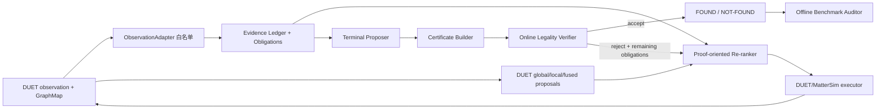

# ProofNav 项目全局实施总纲

> 项目暂定名：**ProofNav: Risk-Calibrated Spatial Proof Optimization for Found-or-Not-Found Navigation**
>
> 校准日期：2026-08-12
>
> 代码基线：VLN-DUET `main@93e8b233164bc079a6db48b8a0a78d123ec8de41`
>
> 当前状态：**M0 已实测完成，M1-A/M1-B 已完成，M2-A/M2-B 已在 controlled evidence 下完成 CPU 逻辑闭环**；尚未实现 M3 真实 predicate perception/calibration、M4 DUET 闭环/re-ranker、正式 paired 数据或训练模型。

相关文档：[新手代码库说明](CODEBASE_BEGINNER_GUIDE.md)；[代码约束下的设计审查](CODE_GROUNDED_DESIGN_REVIEW.md)；[M0 复现报告](reproduction/M0_REPRODUCTION_REPORT.md)；[M1 合同](M1_CONTRACTS.md)；[M1 代码驱动微调](M1_CODE_DRIVEN_CHANGELOG.md)；[M2 架构](M2_ARCHITECTURE.md)；[M2 schema](M2_CERTIFICATE_VERIFIER_SCHEMA.md)；[M2 边界](M2_DEPENDENCY_BOUNDARY.md)；[M2 falsification](M2_FALSIFICATION_REPORT.md)。

## 0. 固定范围与证据标记

### 0.1 固定范围

以下决定不由后续 agent 自行改变：

- 问题固定为 **false-premise Vision-Language Navigation**：目标实体、属性、关系或房间约束可能不成立，智能体需要主动取证，并输出 FOUND 或 NOT-FOUND。
- 方法主线固定为 **ProofNav**：显式证明义务、FOUND 正向证书、NOT-FOUND 反驳覆盖证书、未探索空间保守处理、风险受控终止、证明导向证据采集和独立 verifier。
- 第一阶段代码基座固定为当前 VLN-DUET 仓库。
- 第一阶段任务固定为 REVERIE、VLN-NF 官方 artifact 可用后的直接接入，以及基于 REVERIE 的严格 paired false-premise 扩展。
- 第一阶段是离散 Matterport viewpoint graph，不把项目改成连续机器人导航、普通 ObjectNav、通用 frontier exploration、纯 benchmark 或纯 LLM/VLM agent。

相关工作或一般框架用于收缩表述、构造参照解法和发现风险。能写成增广状态 POMDP，或把反驳覆盖写成 hitting set/set cover，并不取消上述固定路线；项目需要用具体算法、终止接口、验证能力、风险边界和完整成本实验说明实际贡献。

### 0.2 证据标记

- `[源码确认]`：由当前 commit 的实际源码直接确认。
- `[官方说明]`：来自论文、官方仓库或官方项目页。
- `[工程推断]`：由当前调用链得到的接入判断，仍需实现验证。
- `[研究设计]`：本项目约定的接口或方法。
- `[待实验验证]`：不能提前写成结果或保证的主张。

## 1. 研究问题、边界与中心故事

### 1.1 研究问题

在静态、有界、部分可观测环境中，指令被编译为目标实体及属性、关系、区域等谓词。智能体必须在声明的搜索范围、可达范围、观测模型和风险预算下：

1. 找到能支持全部必要谓词的实体，构造 FOUND 正向证书；或
2. 对所有仍可能成立的候选给出反驳覆盖，并保守结算未探索空间，构造 NOT-FOUND 证书；
3. 只在独立 verifier 接受相应证书时作出语义终止。

NOT-FOUND 始终是相对于显式 `scope_contract` 的有界结论，不声称开放世界中的绝对不存在。预算耗尽、DUET STOP 或当前图中没有未访问节点，都不能自动等价为 NOT-FOUND。

### 1.2 一条中心技术主线

`[研究设计]` **DUET 作为候选导航图、目标相关性评分和低层执行基座；ProofNav 在其上维护剩余证明义务与风险/成本账本，用轻量证明导向优化重排真实可执行候选，并只在 verifier 接受 true-path 或 refutation-cover certificate 时输出 FOUND/NOT-FOUND。**

各概念在这条主线中的职责固定为：

- `proof obligation state`：统一决策状态；
- `true path`：FOUND 证书内部的正向实体—谓词 witness；
- `false cut`：保留语义职责，第一阶段实现名采用更准确的 `refutation cover`；
- `frontier/unresolved witness`：显式保存仍可能改变结论的未访问图节点或未决证据单元；
- `proof-oriented optimization`：选择下一证据位置；
- `risk ledger`：记录每项接受/排除及证书组合依赖的校准边界；
- `certificate + verifier`：终止机制，而不是事后自然语言解释。

### 1.3 可测量的贡献边界

项目不声称首次提出 false-premise VLN、首次使用图、首次使用证书、全新 POMDP 表示或全新 hitting set。后续只围绕下列可测量主张组织证据：

- verifier-gated terminal 是否减少不可核验的 FOUND/NOT-FOUND；
- proof-obligation re-ranking 是否在匹配实际决策风险时降低完整导航与感知成本；
- refutation cover、frontier accounting 和 scope contract 是否暴露普通 STOP、阈值、固定预算或 coverage proxy 隐藏的错误；
- 若给出理论结论，只陈述在明确离散证据、观测和依赖假设下能够证明的结构、界或算法性质。

## 2. 第一阶段代码事实与信息边界

### 2.1 DUET 在线可用信息

`[源码确认]` REVERIE 主路径为 `map_nav_src/reverie/main_nav_obj.py` → `ReverieObjectNavBatch` → `GMapObjectNavAgent.rollout` → `GlocalTextPathNavCMT.forward_navigation_per_step`。

每次真正到达 viewpoint 后，适配器可以从当前 observation 和模型输出记录：

- 当前 `scan`、`viewpoint`、位置、朝向和 `viewIndex`；
- 当前 viewpoint 的 36 个预计算 panorama feature 和角度特征；
- 当前可导航邻居的 `viewpointId`、代表 `pointId`、方向、位置及从当前视角取得的 candidate feature；
- 当前 viewpoint 的 object feature、object ID、相对角度特征和归一化宽/高/面积；
- `GraphMap` 中逐步发现的节点/边、visited/unvisited、节点 embedding、步号及已发现图上的距离；
- global/local/fused navigation logits、object grounding logits 和当前访问节点的 STOP probability；
- 实际高层动作、展开的轨迹路径、目标对象输出与终止原因。

源码依据包括：

- `map_nav_src/reverie/env.py::EnvBatch.getStates`、`make_candidate`、`_get_obs`；
- `map_nav_src/reverie/data_utils.py::ObjectFeatureDB.get_object_feature`；
- `map_nav_src/models/graph_utils.py::GraphMap`；
- `map_nav_src/reverie/agent_obj.py::_panorama_feature_variable`、`_nav_gmap_variable`、`rollout`；
- `map_nav_src/models/vilmodel.py::GlocalTextPathNavCMT.forward_navigation_per_step`。

### 2.2 当前主路径缺失的信息

`[源码确认]` 当前 simulator 明确关闭 rendering，`getStates` 注明 RGB 为空；代码不提供 depth、dense geometry、semantic segmentation、真实遮挡关系、连续任意相机位姿或完整未探索环境的在线真值。

`ObjectFeatureDB` 只把 HDF5 特征切片，并导出 `directions`、`sizes`、`obj_ids` 的派生量；没有把 raw bounding box、detector 原始置信度、类别概率或校准所需分数送入 REVERIE 在线 observation。`obj_ids` 是候选身份，不是语义类别标签。REVERIE annotation loader 只保留自由文本、编码、路径和目标 ID，不提供结构化 attribute/relation/room predicate truth。

因此第一阶段不能把以下内容假装成已有能力：连续 3D proof cell、基于遮挡的几何排除、像素级负证据、任意主动视角、现成的感知概率校准，或凭 `obj_logits` 直接得到可靠传感器风险。DUET logits 是任务评分；它们是否可校准必须另行验证。

### 2.3 三层状态边界

| 层 | 合法内容 | 典型来源 | 约束 |
|---|---|---|---|
| agent-visible | 已实际到达 viewpoint 的 panorama/object 特征；当前邻居；增量 GraphMap；DUET logits；历史证据和动作 | `ReverieObjectNavBatch._get_obs` 的非 GT 子集、`GraphMap`、模型输出 | ProofNav 在线 planner、certificate builder 和在线 verifier 只能使用这一层及显式公开的 episode contract |
| simulator execution | simulator 当前位姿、局部 `navigableLocations`；根据已发现图展开后的 endpoint 跳转 | `MatterSim` state、`GMapObjectNavAgent.make_equiv_action` | 用于执行和轨迹核算；远端展开路径的中间节点没有产生 observation，不能算已观察证据 |
| evaluator-only truth | `gt_path`、`gt_end_vps`、`gt_obj_id`、`obj2vps`、完整 connectivity、全对最短路和 benchmark label | `map_nav_src/reverie/env.py` 初始化、`_get_obs` GT 字段、`_eval_item` | 不得流入在线 planner、online verifier、risk ledger 或候选收益计算；只供训练监督或离线评测/审计 |

代码为了原始训练方便，把 GT 字段塞进同一个 observation dict。ProofNav 必须由 `ObservationAdapter` 建立白名单，不能把 Python 对象可访问误认为决策合法。

### 2.4 两种 verifier 模式

- **在线合法性 verifier**：只读 agent-visible event log、证书、`scope_contract`、已批准的 calibration artifact 和公开 action contract。它回答“当时的信息是否足以合法作出这个决定？”，可以拒绝终止并返回未完成义务。
- **离线 benchmark auditor**：可以读 paired label、`BBoxes.json`/`obj2vps`、完整 connectivity、GT object/path 等 evaluator truth。它回答“提交的结论与 benchmark 真值是否一致、证书覆盖声明是否真实？”，绝不向 agent 回传下一动作信息。

online verifier 只核查 evidence provenance、scope、obligation coverage、风险计算和 certificate schema 是否按冻结合同成立。它不直接访问世界真值，也不能单凭形式完整性证明感知结论正确；证书中的语义结论必须由冻结的 perception/calibration artifact 提供统计依据，并由 offline auditor 使用 benchmark truth 评测。

两者的 verdict、输入 schema 和日志必须分开；离线通过不能补救在线证据泄漏，在线形式通过也不能替代离线语义正确性评测。

## 3. 第一阶段离散证明对象

### 3.1 Scope contract

每个 episode 在开始时固定：

```text
scope_contract = {
  scan_id,
  start_viewpoint,
  allowed_viewpoint_domain,
  reachability_rule,
  observation_interface_version,
  predicate_schema_version,
  calibration_version,
  alpha_F_or_risk_budget_ref,
  alpha_N_or_risk_budget_ref,
  resource_limits
}
```

REVERIE 代码目前没有在线 room label；因此第一阶段默认 scope 用**内涵式规则**定义为“从起点经 observation-interface contract 所声明的局部 candidate 接口可达的离散连通分量”，而不是把完整 connectivity 节点/边表交给 agent，也不是模型自行猜测的房间。局部 candidate 接口的邻接完整性不是默认事实，必须由版本化 offline adjacency audit 对 36-view candidate union 与 connectivity truth 的比较支撑；audit 结果只用于冻结接口版本与离线审计，不得写回 runtime state。遍历闭包由在线 event log 按已审计的接口合同检查。若 paired 数据未来公开 room/anchor 范围，必须作为 episode contract 输入并做可见性审计，不能从 GT 终点反推。

### 3.2 Discrete Evidence Unit（DEU）

第一阶段把连续 `proof cell` 收缩为两类可审计单元：

- viewpoint-view unit：`(scan_id, viewpoint_id, view_bin)`，其中 `view_bin∈[0,35]`；
- object-slot unit：`(scan_id, viewpoint_id, obj_id/slot_id)`。

只有 `ObservationAdapter` 在 agent 实际到达该 viewpoint 后发出的事件，才把该 viewpoint 的 36-view 和 object slots 标记为 `observed`。从当前点看到某个 candidate，只能创建目标 viewpoint 的 **proposal/frontier witness**；candidate feature 来自当前位置朝向该邻居的 view bin，不能把目标 viewpoint 标记为已观察。

“有效观察”在第一阶段不表示几何表面被完全看见，只表示指定接口版本确实返回过该离散特征单元。证书必须带这个有限语义。

### 3.3 Predicate evidence ledger

每项谓词状态至少记录：

```text
predicate_record = {
  predicate_id,
  candidate_entity_id,
  supporting_event_ids,
  contradicting_event_ids,
  status: supported | refuted | unresolved,
  score_kind,
  calibration_ref,
  risk_allocation,
  dependency_group
}
```

现有 DUET 可直接提供候选实体和任务 logits，但不能直接提供结构化 attribute/relation/room truth 或校准 sensor likelihood。M2 可以先用 oracle evidence 测试证书逻辑；M3 必须通过独立 `PerceptionAdapter` 明确新增谓词分数及其校准边界，不能把 evaluator truth 接入在线 ledger。

### 3.4 True path、refutation cover 与 unresolved witness

- **true path**：一个实体绑定及其所有必要谓词的 supporting event 集；FOUND 要求没有未决必要谓词，并满足风险约束。
- **refutation cover（保留 false-cut 语义）**：对 scope 内每个仍可能实体/位置假设，至少给出一个合法反驳或证明该假设仍由 unresolved witness 保留。NOT-FOUND 只有在覆盖完整且风险约束成立时才可接受。
- **graph frontier witness**：`GraphMap.node_positions` 中已发现但未访问的节点。
- **evidence unresolved witness**：已访问单元中仍缺少可靠谓词证据的候选，或 scope 中尚未由合法 observation 结算的单元。

`no_vp_left` 只表示当前增量 GraphMap 没有已发现未访问节点；它不是语义证书。若 scope/局部邻接完备性允许推出离散连通分量已遍历，仍需逐项结算感知未决义务。

## 4. 校准后的最小架构



### 4.1 Instruction compiler

输入普通 REVERIE instruction，输出版本化的实体/属性/关系/区域谓词图以及“不确定解析”标记。第一阶段不得把 parser 猜测当作 GT；人工/oracle 结构用于 M1/M2 接口验证，自动编译质量在后续单独评测。

### 4.2 DUET proposal 与证明导向重排

`GMapObjectNavAgent.rollout` 在 `nav_outs` 产生后、原 `argmax/sample` 前有自然接缝：

- local fusion 的真实动作集合是当前相邻 `vp_cand_vpids`；
- global/dynamic/avg fusion 的动作集合是增量 GraphMap 中未访问 `gmap_vpids`；
- `[stop]` 索引保留为 DUET proposal score，不直接充当语义 FOUND/NOT-FOUND；
- 轻量 re-ranker 组合 frozen DUET score、剩余义务的预计证据收益、已发现图路线成本、观测/查询成本和风险下降；
- 第一版无需训练，通过可解释权重或小型优化器验证接口；只有结果支持时才讨论学习参数。

对于未访问节点，预计证据收益只能来自 proposal feature、义务先验或后续获批的感知模型，必须标成预测量，不能引用目标节点真实 observation。

### 4.3 执行与成本核算

`make_equiv_action` 可把远端 GraphMap action 展开为已发现图上的路径，并直接让 simulator 在 endpoint 开新状态。完整账本至少计入：

- 高层决策次数；
- 展开后的边数和 metric travel distance；
- 真实产生 observation 的 endpoint 次数；
- perception/query 次数及计算；
- re-ranking、certificate build、online verify 的计算与存储；
- calibration、预处理、缓存和模型训练的离线成本。

展开路径上的中间节点进入轨迹和移动成本，但当前代码没有在其中逐点调用 `_get_obs`；因此不能将它们计作证据观察。若未来逐点观察，必须修改执行接口并同步计费。

### 4.4 独立语义终止

第一阶段的控制语义为：

```text
CONTINUE(viewpoint_id)
PROPOSE_FOUND(entity_id, certificate_id)
PROPOSE_NOT_FOUND(certificate_id)
```

online verifier 接受后才生成最终 FOUND/NOT-FOUND。拒绝时返回具体 `remaining_obligations` 给 re-ranker。原 DUET STOP、`no_vp_left`、最大步数和已结束状态必须记录为不同 `termination_cause`；资源耗尽可以迫使 episode 结束，但不能伪装成已验证 NOT-FOUND。

双风险预算的冻结语义为：

\[
\text{FOUND only if }V(C_F)=\mathrm{accept}
\land \widehat R_F(C_F)\leq\alpha_F
\]

\[
\text{NOT\mbox{-}FOUND only if }V(C_N)=\mathrm{accept}
\land \widehat R_N(C_N)\leq\alpha_N
\]

其中 \(\alpha_F\) 控制 false-FOUND，\(\alpha_N\) 控制 false-NOT-FOUND。当前只冻结语义、字段和独立预算接口，不声称已经获得风险保证，也不预设默认数值。

最终被 verifier 接受的任务答案仍只有 FOUND/NOT-FOUND。若 budget、no-frontier、max-step 或 error 迫使执行结束且没有证书获接受，内部 prediction 必须允许：

```json
{
  "semantic_decision": null,
  "decision_status": "UNRESOLVED",
  "termination_cause": "budget | no_frontier | max_step | error"
}
```

`UNRESOLVED` 仅是执行与评测诊断状态，不改变 benchmark 的二分类任务定义，也不得在汇总时并入 NOT-FOUND。

## 5. DUET 保留—扩展—替换边界

| 类别 | 组件 | 代码接入点 | 第一阶段处理 |
|---|---|---|---|
| 保留 | tokenizer、language/panorama/global/local encoders、GraphMap、候选 mask、路径执行、原 REVERIE evaluator | `map_nav_src/reverie/agent_obj.py`、`map_nav_src/models/vilmodel.py`、`map_nav_src/models/graph_utils.py`、`map_nav_src/reverie/env.py` | 先冻结为 proposal/execution baseline；不改原源码，后续通过新模块和最小接线集成 |
| 保留但降级语义 | global/local/fused logits、object logits、STOP probability | `forward_navigation_per_step`、`rollout` | 作为 proposal/grounding 信号，不宣称是校准证据或最终语义终止 |
| 扩展 | agent-visible observation adapter、event log、DEU、proof obligation、risk/cost ledger | `_get_obs` 输出边界、`rollout` 每步 | 新文件实现白名单和不可变事件；禁止 GT 字段进入在线状态 |
| 扩展 | proof-oriented candidate re-ranker | `rollout` 中 `nav_outs` 后、动作选择前 | 只重排真实可执行的 local 或 gmap candidates；记录原/新 score 与代价 |
| 扩展 | terminal proposer、certificate builder、online verifier | 原 STOP 判断前的外部 controller/最小接线 | 与 DUET STOP/object argmax 解耦；verifier 拒绝可继续导航 |
| 扩展 | offline benchmark auditor 与 prediction schema | `BaseAgent.get_results`、`ReverieObjectNavBatch.eval_metrics` 外层 | 保留原指标并增加 decision/certificate/risk/validity 字段；真值只在离线层使用 |
| 替换 | “STOP 即最终答案”、结束时跨 visited node 取最高 STOP/object 的语义 | `map_nav_src/reverie/agent_obj.py::rollout` 终止段 | ProofNav 模式下由 verifier-gated FOUND/NOT-FOUND 取代；原逻辑保留为 baseline |
| 延后 | raw RGB/depth/连续几何、dense visibility、复杂端到端新 policy | 当前路径无接口 | 不在第一阶段伪造；若确有必要，以独立 perception adapter 和新资源审批进入后续阶段 |

原始 `map_nav_src/`、`pretrain_src/` 在本轮没有修改。将来实现优先新增 `proofnav/` 包和单独入口；只有不可避免的接线才对原 rollout 做小补丁，并保持 baseline 行为可复现。

## 6. 三个代码内生增强点

### 6.1 Proof-obligation re-ranking

采纳。源码在单步同时暴露 global/local/fused logits、真实 action ID 和 GraphMap distance，适合让冻结 DUET 提出位置、ProofNav 评价“哪个位置最有助于完成证书”。验收看 matched-risk 下的完整成本、义务完成率及对原 proposal 排序的可解释改变。

### 6.2 Verifier-gated terminal

采纳。源码把 STOP、`no_vp_left`、步数上限和结束状态合并，且最终会回到所有 visited 节点中最高 STOP 的位置；这正需要独立语义终止层。验收看不合法证书拒绝、剩余义务反馈、两类 verifier 无泄漏以及接受后结论一致性。

### 6.3 Scope contract + dual verifier boundary

采纳为完整性机制，不单独包装成 headline contribution。它直接防止完整 connectivity、`obj2vps`、GT path/object 和 scope truth 偷渡进 planner，并限定 NOT-FOUND 的有效范围。验收用故意注入 GT 字段、缺失 scope、越界 evidence event 和离线真值反馈等测试。

DUET dual-scale 表征保留为 re-ranker 输入，但不另立“dual-scale proof control”：当前 local 分支是当前 panorama 的导航/object scoring，global 分支是增量拓扑 proposal，并没有 room label 或主动感知 action；直接包装成新证明机制会模糊与 DUET/两阶段探索方法的差别。

## 7. 数据与 benchmark 计划

### 7.1 REVERIE

用于复现 DUET 正例导航/grounding 主链，验证 action、observation、trajectory、object ID 和 evaluator 兼容性。原 REVERIE 不支持 NOT-FOUND，不能单独验证完整 ProofNav。

### 7.2 VLN-NF

官方代码和数据公开后，先做只读 schema/许可证/指标审计，再建立适配层；不根据论文描述臆造 artifact。保留其官方 split 和 paired protocol，明确与本项目 certificate 字段的增量关系。

### 7.3 Paired REVERIE extension

同一起点、场景、路线机会和语言复杂度构成 FOUND/NOT-FOUND 对；只改变一个可审计的前提。最小覆盖实体不存在、属性不符、关系不符、房间/anchor 不符。每个样本需独立保存：原/改指令、结构化谓词、改变项、scope、真值来源、可见/可达域和审计记录。

本阶段只冻结 schema 原则，不生成数据。

## 8. Prediction、certificate 与评测接口

### 8.1 Prediction 最小 schema

```json
{
  "instr_id": "...",
  "trajectory": [["viewpoint_id"]],
  "pred_objid": null,
  "semantic_decision": "FOUND | NOT_FOUND | null",
  "decision_status": "VERIFIED | UNRESOLVED",
  "termination_cause": "verifier_accept | budget | no_frontier | max_step | error",
  "certificate_id": "...",
  "online_verifier": {"accepted": false, "reason_codes": []},
  "scope_contract_id": "...",
  "risk_claim": {
    "decision": "FOUND | NOT_FOUND",
    "risk_type": "false_found | false_not_found",
    "upper_bound": null,
    "budget": null,
    "calibration_version": "...",
    "composition_version": "..."
  },
  "cost_ledger": {}
}
```

正式提交格式可由 adapter 压缩；内部日志必须保留决策和执行原因，不能只输出 `trajectory + pred_objid`。`UNRESOLVED` 时 `risk_claim` 必须为 `null`，不能为未获接受的执行结果附加已验证风险声明。

### 8.2 Certificate 最小 schema

公共头包含 episode、instruction/predicate/scope/calibration 版本、agent-visible event hashes、风险组合规则和成本摘要。

- FOUND payload：entity binding、true path、逐谓词 supporting events、未决谓词为空的声明。
- NOT-FOUND payload：scope hypothesis index、refutation cover、frontier/unresolved witness 结算和未覆盖项为空的声明。

自然语言解释可以附加，但不参与 verifier 的逻辑接受条件。

### 8.3 指标

保留原 REVERIE SR/SPL/RGS/RGSPL，并增加：

- FOUND accuracy、NOT-FOUND accuracy、balanced decision accuracy；
- false-FOUND、false-NOT-FOUND、abstention/forced-termination rate；
- online certificate acceptance、offline certificate correctness、leakage violation；
- obligation coverage、unresolved-at-termination、certificate size；
- navigation length/steps、observation/query count、计算、存储和离线成本；
- matched-risk cost、risk–coverage/cost curve 与 calibration violation。

## 9. Baseline、消融与完整成本

必要 baseline：原 DUET；DUET + NOT-FOUND/STOP 阈值；固定 budget；frontier/no-vp-left；coverage threshold；VLN-NF 官方方法可用后的官方实现；ProofNav 使用的通用优化参照（如 belief/search、set-cover/hitting-set 或 orienteering 形式）在同一信息和成本合同下比较。

必要消融：无 re-ranking、无 verifier gate、无 risk ledger、忽略 unresolved witness、只用 topology frontier、只用 DUET object/STOP score、局部候选与全局候选、oracle 与非 oracle evidence。

成本账本禁止把工作藏入缓存或 oracle，必须计入：特征/模型预处理、训练与数据、每步 encoder、候选枚举、路线展开、perception/query、certificate/verifier、离线 calibration、存储、硬件与 amortization。比较时统一 action semantics；远端路径的移动成本和 observation 次数分别记录。

## 10. 固定路线下的设计验证与风险记录

以下检查用于校准实现和 claim 边界，不授权 agent 改变方向：

| 检查 | 最小验证 | 影响 | 固定主线内的修复 |
|---|---|---|---|
| 信息泄漏 | 构造包含 GT 字段的 observation，确认白名单拒绝；静态追踪 planner 输入 | 在线合法性失真 | 强制 typed observation、字段 allowlist、双 verifier 进程/文件边界 |
| 远端动作证据误计 | 两跳以上 gmap action 的 trace | coverage 与成本虚高 | 只为 `_get_obs` 产生的 endpoint 建 event；中间节点只计 travel |
| candidate `distance` 误用 | 首次与缓存 candidate schema 对比 | 运行时字段不稳定且语义错误 | 路线成本统一来自已发现 `GraphMap.graph.distance`；不用 candidate angular distance |
| 图耗尽误当语义否定 | `no_vp_left=True` 但存在未决 predicate 的小例 | false-NOT-FOUND | 分离 graph frontier 和 evidence unresolved；verifier 拒绝 |
| DUET logits 误当风险 | reliability/calibration/shift stress test | 风险声明无效 | 只标 proposal score；M3 增加显式 perception/calibration adapter |
| scope 不可证 | 不完整 scope 或 room label 缺失样例 | NOT-FOUND 无定义 | 降级为公开离散 viewpoint scope；保留未覆盖 witness |
| 相关误差累积 | 同 viewpoint/相邻 view 的相关观测合成测试 | 风险上界过度乐观 | dependency group、保守组合或 sequence-level calibration |
| 连通域遍历退化 | 大连通图上测量 NOT-FOUND 所需访问率与成本 | 整个连通域 scope 可能使 NOT-FOUND 接近完全遍历 | 保持固定主线，利用证据复用、可审计 scope 收缩和特殊结构优化；如实报告 coverage–risk–cost 曲线 |
| 一般框架覆盖表述 | 对照相同状态、动作、信息、目标和成本 | “全新表示”主张过强 | 把框架用作求解/界的工具，主张限定到具体闭环能力和测得结果 |

重大困难必须记录其属于接口、数据、算法、理论或实验哪一层，并给出一至三个 ProofNav 主线内的最小修复；方向、benchmark 和代码基座仍由用户决定。

## 11. 分阶段实施路线

M0、M1 已完成并冻结。用户本轮明确授权 M2 controlled/oracle evidence、certificate、dual verifier 与 standalone terminal gate；M3+、正式数据生成、训练和正式实验仍需另行授权。

### M0：复现准备与原 DUET REVERIE evaluation

**状态：已完成（2026-08-12）。** 实际指标、资源 hash、真实 trace 和审计结论见 [M0 复现报告](reproduction/M0_REPRODUCTION_REPORT.md)，后续里程碑不重复运行 M0。

**目的：** 建立未修改 baseline 的可复现环境和字段 trace。

**接入文件：** 只读核对 `map_nav_src/reverie/main_nav_obj.py`、`parser.py`、`scripts/run_reverie.sh`；新建独立环境清单和复现日志。

**验收：** commit、配置、依赖、数据/权重来源与 hash 完整；原始指标可复现；至少一个 episode 的 observation/action/trajectory schema 被记录；没有 ProofNav 行为变更。

### M1-A：接口合同、prediction schema 与 paired evaluator

**状态：已完成最小 vertical slice（2026-08-12）。**

**目的：** 在不接方法的情况下固定 agent-visible allowlist、scope、FOUND/NOT-FOUND 输出和两类 verifier 的数据边界。

**实际文件：** `proofnav/contracts.py`、`adapters.py`、`validation.py`、`reference_checker.py`、`evaluator.py` 与 `tests/m1/`；不复用 evaluator truth 作为在线输入。

**验收结果：** strict version/allowlist、GT 注入拒绝、branch-aware action、observation provenance、三状态语义、termination 分离、原 REVERIE 输出兼容和微型离线 evaluator 均由 CPU 单测通过。M1 reference checker 不是 M2 runtime verifier。

### M1-B：Paired REVERIE 数据合同与 validator

**状态：已完成合同与 synthetic micro fixtures（2026-08-12）；未生成正式数据。**

**目的：** 在正式生成数据前冻结 paired false-premise 数据规范。

**冻结内容：** 实体不存在、属性不符、关系不符、房间/anchor 不符四类 false premise；每对样本只改变一个可审计前提，并保持起点、场景、可达机会、语言复杂度与非目标条件尽量匹配；固定 train/validation/test split 及去重/泄漏规则；记录数据来源、scope、结构化谓词、改变项、真值来源和人工审计轨迹。

**实际文件：** `proofnav/paired.py` 与 `tests/m1/fixtures.py` 中的版本化合同、四类 synthetic micro pair 和自动 validator；evaluator truth 与 agent-visible member 分区。

**验收结果：** validator 已能发现配对字段/GT provenance 缺失、多 premise 变化、split leakage、duplicate/fingerprint 篡改和 scope 不一致。正式生成 paired 数据仍需用户后续单独授权。

### M2：Oracle evidence、证书与 verifier correctness

**状态：M2-A / M2-B 已完成 controlled-evidence CPU vertical slice（2026-08-12）。**

**目的：** 先隔离验证 true path、refutation cover、frontier/unresolved 和闭环 verifier 逻辑。

**实际文件：** `proofnav/runtime/{state,certificate,verifier,terminal}.py` 与
`proofnav/offline/{oracle_evidence,oracle_verifier}.py`。runtime 不反向导入 offline；生产
evidence admission 在没有 M3 code-owned adapter 前保持 zero-admission。

**验收结果：** 正/负/缺失/冲突/越界、四类 false premise、scope/frontier/stale、budget/risk/
cost、GT firewall、terminal gate、M0 trace replay 和 16-state exhaustive micro-check 已由 CPU
测试覆盖；offline auditor 独立发现了错误 predicate 导致的 `FALSE_ACCEPT` 反例。M2 因而只
建立“validated-and-correct evidence 条件下”的逻辑闭环，不报告为在线事实可靠性。

### M3：Perception adapter、predicate evidence 与风险校准

**目的：** 建立现有 feature/logit 到实体、属性、关系、room/anchor 谓词的明确支持边界和 calibration artifact。

**候选新文件：** `proofnav/perception/`、`proofnav/calibration/`。

**验收：** 每种 score 的来源、版本、依赖组和适用域可追踪；held-out calibration、shift 和相关误差检查；不具支持能力的谓词保持 unresolved，不用 GT 填补。

### M4：Proof-obligation re-ranker 与闭环执行

**目的：** 冻结 DUET proposal，接入轻量 re-ranker、成本账本，并把 M2 standalone
verifier-gated terminal 接到正式闭环。

**候选新文件：** `proofnav/planner/reranker.py`、`proofnav/controller.py`；对 `GMapObjectNavAgent.rollout` 只做最小可开关接线。

**验收：** local/global action ID 映射正确；mask 后只选合法 candidate；远端路径成本/证据分账正确；verifier 拒绝继续导航；关闭开关时与原 baseline 一致。

### M5：正式 benchmark、消融和误差分析

**目的：** 在 REVERIE 正例、paired extension 和可用的 VLN-NF 官方 split 上进行 matched-risk 比较。

**验收：** seed/config/checkpoint/data hash 完整；主指标、证书指标、成本和失败类型齐全；不把 oracle、预处理或 GPU 并行从成本中删除；只报告实际支持的 claim。

### M6：受证据约束的后续增强

只有 M0–M5 显示明确需要且用户批准时，才考虑训练 re-ranker、增加原始感知接口、连续/更细几何或其他数据集。它们不是第一阶段前置条件，也不能替换固定主任务。

## 12. 当前锁定项、开放风险与权限

### 锁定项

- false-premise VLN、FOUND/NOT-FOUND、ProofNav 核心语义；
- DUET 基座和第一阶段 benchmark；
- agent-visible 与 evaluator-only truth 隔离；
- 第一阶段离散 DEU；
- true path、refutation cover/false-cut 语义、frontier/unresolved、risk、proof acquisition、independent verifier；
- 最多三个代码内生增强点，即第 6 节三项。

### 开放风险

- paired REVERIE 的公开授权、标注成本和 room/anchor schema；
- VLN-NF 官方 artifact 的真实接口；
- 当前预计算 object feature 是否足以支持属性/关系风险校准；
- instruction compiler 错误如何进入风险账本；
- 有限离散 observation 语义能否支持有意义而不过度保守的 NOT-FOUND；
- 整个离散连通域作为 scope 时，NOT-FOUND 是否退化为近乎完全遍历，以及怎样在不削弱证书语义的前提下降低完整成本；
- 通用优化参照下 re-ranking 的增益、复杂度和完整成本。

### 权限

M0、M1 与 M2 的已完成资产允许维护和小型 CPU 回归。不得自行安装关键依赖、下载大型资源、使用 GPU 运行正式实验、训练、生成正式 paired 数据或进入 M3+ perception/calibration、M4 re-ranker/正式 DUET 接线。Agent 发现风险时可以收缩 claim、改接口或提出主线内小修复，但无权自行更换问题、benchmark、DUET 基座或取消核心语义。

## 13. 当前阶段出口

代码事实、信息边界、第一阶段离散对象、三项增强、接入接口和里程碑已经冻结。**M0、M1 与 controlled-evidence M2 均已达到各自限定验收；当前阶段边界停在 M3 之前。** 下一步若进入 M3，只能在用户明确授权后实现真实 predicate adapter 与 calibration falsification；不得把 M2 oracle replay 当成感知能力，也不得跳到 re-ranking、训练或正式 benchmark。
